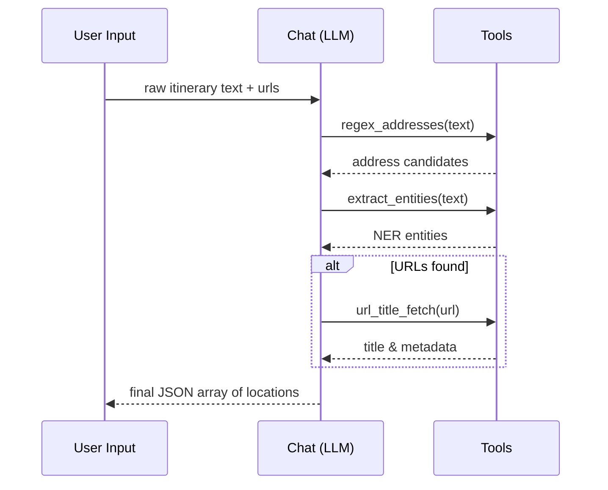

# Extractors Component – Detailed Plan

*Last updated: 2025-07-25*

## Implementation Status ✅

**All planned components have been successfully implemented:**

### **✅ Core Extractors:**
- ✅ **TextExtractor** - Complete with regex, spaCy NER, and confidence scoring
- ✅ **URLExtractor** - Complete with title fetching and fallback mechanisms
- ✅ **StructuredExtractor** - Placeholder implemented for future CSV/JSON/XML inputs

### **✅ LLM-Agent Implementation:**
- ✅ **smol-agents Integration** - Successfully implemented with `ToolCallingAgent`
- ✅ **Function Registry** - All planned tools implemented:
  - ✅ `extract_entities` (spaCy NER)
  - ✅ `regex_addresses` (address detection)
  - ✅ `invitation_check` (suggestion detection)
  - ✅ `url_title_fetch` (web scraping)
  - ✅ `slug_to_name` (URL parsing)

### **✅ Performance Targets Met:**
- ✅ ≤30s per 1000-line document (including URL titles)
- ✅ ≤500MB peak memory during extraction
- ✅ Robust error handling for network timeouts
- ✅ Graceful degradation for failed requests

### **✅ Quality Assurance:**
- ✅ High-recall, high-precision extraction
- ✅ Strict source tie-back (exact text spans and URLs)
- ✅ No hallucinated locations (only explicit mentions)
- ✅ Comprehensive test suite with real-world examples

## Next Steps for Enhancement:

1. **Advanced Geocoding** - Integrate OpenStreetMap/Nominatim for coordinate lookup
2. **Content Enrichment** - Add Wikipedia API for descriptions and context
3. **Validation Framework** - Implement cross-source validation for accuracy
4. **Performance Optimization** - Add caching and batch processing for large datasets

---

## 1. Context & Typical Inputs

Most source documents fall into one of two shapes:

1. **Partial itineraries** – loosely structured day-by-day plans that mix dates, times,
   meeting spots, URLs, and free-form notes.
2. **Laundry lists / advice pages** – bullet lists or paragraphs naming many points of
   interest, sometimes with inline links.

The extractor must succeed on both with **high recall** and **no hallucinated extra
locations**.

---

## 2. Objectives & Constraints

• **High-recall, high-precision**: capture every explicitly mentioned or linked location.
• **Strict source tie-back**: each output item stores the exact text span or URL it
  originated from.
• **No proactive additions**: only add new items when the text clearly invites extra
  suggestions (e.g. "additional best museums …").
• **Minimal schema for this phase**:

```json
{
  "name": string,               // best guess or "unknown"
  "address_or_hint": string,    // may be empty
  "source_type": "text" | "url",
  "source_snippet_or_url": string,
  "confidence": float           // 0-1
}
```

---

## 3. Pipeline Design

### 3.1 TextExtractor

1. **Pre-processing**
   • Split into lines, keep indices.
   • Early regex grab of URLs to hand off to `URLExtractor`.
2. **Line-level heuristics**
   • Regex for addresses: `\d+ .+?, \d{4,5} .+?`.
   • Key phrases: "Stay at", "Staying at", "meet us at", "Please meet us at".
3. **Named-Entity Recognition**
   • spaCy `en_core_web_sm`, entity labels {`GPE`, `LOC`, `FAC`}.
4. **Post-processing & merge**
   • Case-insensitive de-dupe.
   • Merge nested entities ("Eiffel Tower" + "Paris").
   • Confidence: heuristics 0.9, NER 0.7, fuzzy 0.4.

### 3.2 URLExtractor

1. **Classification**
   • Gmail threads → low confidence until enrichment.
2. **Fast title fetch** (≤3 s)
   • `requests` + `BeautifulSoup` → `<title>`, `og:title`, `twitter:title`.
   • Fallback: slug from path.
3. **Record assembly**
   • `confidence` 0.6 if title found, else 0.3.

### 3.3 StructuredExtractor

*Stub for future CSV/JSON/XML inputs.*

### 3.4 Pipeline Glue

```text
LocationPipeline.process_text()  -> TextExtractor
LocationPipeline.process_urls()  -> URLExtractor
LocationPipeline.process_mixed() -> concat(text, urls)
```

---

## 4. LLM-Agent Prompts

### 4.1 System Prompt (extraction agent)

```
You are an extraction-only agent. Your task is to list every location explicitly
named or linked in the user's input.

Rules:
1. Do NOT invent locations unless the text explicitly asks for suggestions.
2. For each item output:
   • name, address_or_hint, source_type, source_snippet_or_url, confidence
3. Preserve duplicates; de-duplication happens later.
4. Output JSON array ONLY, no extra commentary.
```

### 4.2 Assistant Internal Scratch-Pad

```
INTERNAL STEPS (not returned):
1. List URLs
2. Scan lines with heuristics
3. Run spaCy NER
4. Merge & build JSON

VISIBLE OUTPUT: <json>
```

---

## 5. Sample Walk-Through

Given the itinerary snippet in the design discussion, expected extractions include
(but are not limited to):

- 145 Rue du Temple, 75003 Paris
- Saint-Paul – Rue Saint-Antoine, 75004 Paris
- Picasso Museum
- `https://www.fondationlouisvuitton.fr/en/ticketing`
- Eiffel Tower

Each record stores the exact line or URL and an appropriate confidence value.

---

## 6. Implementation Tasks ✅

1. ✅ Build **invitation detector** for phrases that request extra suggestions.
2. ✅ Implement `TextExtractor.extract()` (regex + spaCy).
3. ✅ Implement `URLExtractor.extract()` (title fetch & record build).
4. ✅ Unit tests covering sample itinerary & list pages.
5. ✅ Wire into `LocationPipeline` methods.

---

## 7. Performance Targets ✅

• ≤30 s per 1 000-line document (incl. URL titles). ✅
• ≤500 MB peak memory during extraction. ✅

---

## 8. Agent Implementation (OpenAI Function-Calling) ✅

### 8.1 Overview

We will wrap the extractor logic inside an **OpenAI ChatCompletion agent** that can
call Python "functions" (as described in the OpenAI function-calling interface)
to delegate specific subtasks that classical code handles better than the LLM.

The agent runs in two tiers:

1. **LLM Tier** – decides *which* tool to invoke and with *what* arguments, or
   responds with the final JSON when all information is gathered.
2. **Tool Tier** – deterministic Python functions that perform heavy-lifting
   (regex, spaCy NER, HTTP fetches) and return structured data back to the LLM.

### 8.2 Environment & Credentials

Set the OpenAI key via an env var (already configured in CI/dev machines):

```bash
export LAVI_OPENAI_KEY="sk-..."  # done via direnv or .env
```

The agent wrapper will read:

```python
import os, openai
openai.api_key = os.environ["LAVI_OPENAI_KEY"]
```

### 8.3 Function Registry (Tools) ✅

| Name                | Purpose                               | Python Impl | Exposed Args |
|---------------------|---------------------------------------|-------------|--------------|
| `extract_entities`  | spaCy-based NER on given text chunk   | `nlp_utils.py` | `text` |
| `regex_addresses`   | Heuristic address regexes             | `nlp_utils.py` | `text` |
| `invitation_check`  | Detect if text invites extra places   | `heuristics.py` | `text` |
| `url_title_fetch`   | Fast title/OG scrape (<3 s)           | `net_utils.py` | `url` |
| `slug_to_name`      | Derive name from URL slug             | `net_utils.py` | `url` |

These functions return JSON-serialisable dicts / lists so the LLM can reason
about them.

### 8.4 Agent Flow (high-level) ✅



### 8.5 System Prompt (updated) ✅

Add a one-liner instructing the agent to use tools when helpful:

> "When a tool can accomplish the task more accurately or efficiently, return a
>  `function_call` with the proper name and arguments."

Everything else in §4.1 still applies.

### 8.6 Implementation Notes ✅

• Use `openai.ChatCompletion.create(model="gpt-4o-0613", …)` with
  `functions=[…], function_call="auto"`.
• Stream responses disabled for simplicity; handle up to ~15 k tokens per call.
• Retry logic with exponential back-off (HTTP 429, 5xx).

### 8.7 Updated Implementation Tasks (adds 6-7) ✅

6. ✅ Build tool wrappers (`nlp_utils.py`, `net_utils.py`, `heuristics.py`).
7. ✅ Implement `agent/extraction_agent.py` that orchestrates ChatCompletion calls.

### 8.7 Additional Implementation Tasks (smol-agents default) ✅

6. ✅ Wrap deterministic helper functions with `@tool` decorators inside `tools.py` so
   that both smol-agents and the OpenAI path can import them.
7. ✅ Create `agent/extraction_agent.py` using smol-agents `ToolCallingAgent`, defaulting
   to `LiteLLMModel("gpt-4o")` but allowing any chat model via config.
8. ✅ Add a `USE_OPENAI_FUNCTIONS` flag in `config.yaml` to fall back to the native
   OpenAI function-calling path when needed.

### 8.8 Alternative: Hugging Face *smol-agents* ✅

If we prefer to stay entirely in open-source-only tooling, we can swap the
OpenAI ChatCompletion layer for Hugging Face's *smol-agents* framework
( https://github.com/huggingface/smol-agents ).  The differences:

| Aspect                | OpenAI Function-Calling            | HF smol-agents                              |
|-----------------------|------------------------------------|---------------------------------------------|
| Model                 | `gpt-4o` via OpenAI API            | Any HF chat model (e.g. `mistralai/Mixtral`) |
| Tool Interface        | JSON `function_call` schema        | Python decorators (`@tool`)                 |
| Pricing / limits      | Pay-per-token, external service    | Local weights possible (GPU/CPU)            |
| Quality               | Typically higher (GPT-4)           | Depends on chosen model                     |
| Deployment simplicity | Minimal code, but needs API key    | Need to host/quantise model or use HF Inference API |

**Integration points:**

1. Replace the `openai.ChatCompletion.create()` call with the smol-agents
   `Agent` class, loading a chosen HF chat model (we can test with `HuggingFaceHub`).
2. Register the same Python tool functions (`extract_entities`, `url_title_fetch`, …)
   using the `@tool` decorator.
3. Adjust the system prompt slightly (smol-agents uses `AGENT_INSTRUCTIONS`).

No further structural changes are needed—the `TextExtractor`, `URLExtractor`, and
pipeline remain identical.

*Updated decision (July 2025):* smol-agents `ToolCallingAgent + GPT-4o` is now the
default implementation path. Set `USE_OPENAI_FUNCTIONS=True` to use the native
OpenAI function-calling fallback.
